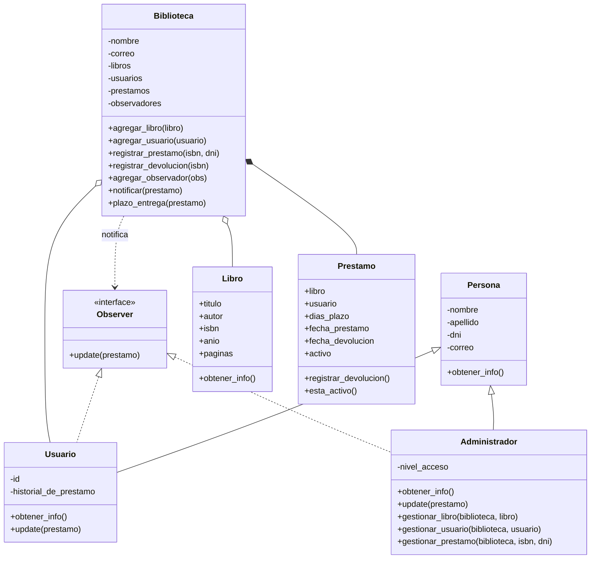

# Sistema de Gestión de Biblioteca Digital

Trabajo Práctico Final – Unidad I – Programación Avanzada
Universidad Nacional Guillermo Brown

## Descripción

Aplicación en Python que permite administrar una biblioteca: alta,baja,
modificación y listado de libros y usuarios, y registro de préstamos y
devoluciones. Un libro no puede prestarse si ya tiene un préstamo activo.
Todo el sistema está modelado con Programación Orientada a Objetos siguiendo
el diagrama UML incluido en el repositorio.

## Integrantes

* Edgar Mendieta
* Sabrina Elisabet Valientes
* Valeria Elizabeth Igarzabal
* Brenda Estefanía Ordóñez Maldonado

## Cómo ejecutar el proyecto

Requiere Python 3 (no usa librerías externas, solo la libreria estandar).

```
python demostracion_funcional.py
```

El script `demostracion_funcional.py` da de alta usuarios y libros, registra
préstamos y devoluciones, y al final muestra el aviso de vencimiento generado
por el patrón Observer.

## Estructura del proyecto

* `clases_metaclases.py`: metaclase y clases del dominio (Persona, Observer, Usuario, Administrador, Libro, Préstamo).
* `clase_biblioteca.py`: clase Biblioteca (Singleton) y el decorador propio.
* `demostracion_funcional.py`: script que recorre todo el sistema de punta a punta.
* `uml_ gestion_de_biblioteca.drawio` / `uml_gesion_de_biblioteca_virtual.drawio.pdf`: diagrama UML del sistema.

## Cómo se cumplen los requerimientos técnicos

* **Herencia:** `Persona` es la clase base; `Usuario` y `Administrador` heredan de ella.
* **Polimorfismo:** todas las personas (y los libros) implementan `obtener_info()` a su manera.
* **Agregación:** `Biblioteca` contiene listas de `Libro` y `Usuario`, que se crean por fuera y existen sin la biblioteca (rombo blanco en el UML).
* **Composición:** los `Prestamo` los crea la propia `Biblioteca` dentro de `registrar_prestamo()`; no existen fuera de ella (rombo negro en el UML).
* **Decorador propio:** `registrar_operacion` envuelve los métodos de gestión y anota cada operación en la bitácora de la biblioteca.
* **Metaclase:** `MetaEntidad` (derivada de `ABCMeta`, que deriva de `type`) registra automáticamente cada clase en un catálogo interno.
* **Patrones de diseño:** Singleton en `Biblioteca` y Observer para avisar vencimientos de préstamos.

## Justificación de los patrones de diseño

### Singleton

Se usó **Singleton** en la clase `Biblioteca` porque en el sistema existe una
única biblioteca: un único catálogo de libros, usuarios y préstamos
compartido por todo el programa. El patrón garantiza que, sin importar desde
dónde se la "instancie", siempre se trabaja sobre el mismo estado, evitando
catálogos duplicados o inconsistentes.

Somos conscientes de sus contras (introduce estado global y dificulta el
testing aislado), por eso el acceso al estado queda encapsulado dentro de los
métodos de la clase y no se expone como variable global suelta.

### Observer

Se usó **Observer** para avisar cuando se vence el plazo de un préstamo.
`Usuario` y `Administrador` implementan la interfaz `Observer` (método
`update()`), y se suscriben a la `Biblioteca` con `agregar_observador()`.
Cuando `plazo_entrega()` detecta que un préstamo está vencido, llama a
`notificar()`, que recorre la lista de observadores y les avisa. Así
`Biblioteca` no necesita saber cómo se notifica cada uno (email, mensaje,
etc.), solo que responden a `update()`.

## Diagrama UML


